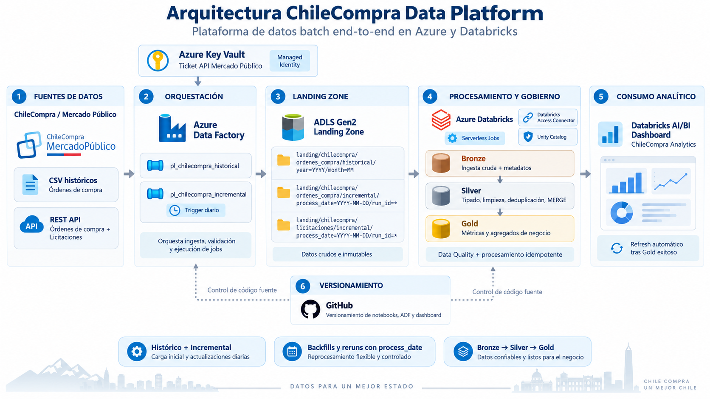

# Arquitectura

Este documento describe la arquitectura técnica de **ChileCompra Data Platform**, una plataforma batch construida en Azure y Databricks para procesar datos públicos de ChileCompra / Mercado Público.



---

## Flujo general

```text
ChileCompra / Mercado Público
        │
        ├── CSV históricos
        └── REST API
                │
                ▼
        Azure Data Factory
                │
                ▼
          ADLS Gen2 Landing
                │
                ▼
        Azure Databricks
                │
        Bronze → Silver → Gold
                │
                ▼
      Databricks AI/BI Dashboard
```

El procesamiento combina una carga histórica inicial con una ingesta incremental diaria.

---

## 1. Fuentes de datos

La plataforma utiliza dos tipos de fuente.

### Datos históricos

Archivos CSV masivos publicados por ChileCompra.

Se utilizan para realizar el bootstrap inicial de órdenes de compra y sus ítems.

```text
Enero 2026 → Agosto 2026
```

### Datos incrementales

La API REST de Mercado Público se utiliza diariamente para obtener:

- órdenes de compra;
- licitaciones.

La API es una fuente mutable y no entrega semántica CDC completa, por lo que la plataforma no interpreta automáticamente la ausencia de un registro como una eliminación.

---

## 2. Azure Data Factory

Azure Data Factory funciona como orquestador externo.

Existen dos pipelines principales:

```text
pl_chilecompra_historial
pl_chilecompra_incremental
```

### Pipeline histórico

Permite cargar un archivo histórico específico mediante parámetros de año y mes.

```text
CSV
 ↓
Landing
 ↓
Bronze
 ↓
Silver órdenes
 ↓
Silver ítems
```

Se utiliza principalmente para bootstrap y backfills históricos.

### Pipeline incremental

Se ejecuta diariamente y procesa una fecha lógica mediante:

```text
process_date
```

Las órdenes de compra y licitaciones se procesan en ramas independientes y paralelas.

```text
                    ┌─ OC → Landing → Bronze → Silver
ADF incremental ────┤
                    └─ Licitaciones → Landing → Bronze → Silver
                                      │
                              ambas exitosas
                                      ↓
                                     Gold
                                      ↓
                             Dashboard refresh
```

---

## 3. Seguridad de la ingesta

El ticket utilizado para consumir la API de Mercado Público se almacena en:

```text
Azure Key Vault
```

Azure Data Factory utiliza **Managed Identity** para acceder al secreto.

De esta forma, el ticket no se almacena directamente en:

- notebooks;
- pipelines;
- archivos de configuración;
- repositorio Git.

---

## 4. Landing Zone

Los datos extraídos por ADF se almacenan primero en ADLS Gen2.

La Landing Zone conserva cada ejecución de forma independiente.

```text
landing/
└── chilecompra/
    ├── ordenes_compra/
    │   ├── historical/
    │   │   └── year=YYYY/month=MM/
    │   │
    │   └── incremental/
    │       └── process_date=YYYY-MM-DD/
    │           └── run_id=<ADF_RUN_ID>/
    │
    └── licitaciones/
        └── incremental/
            └── process_date=YYYY-MM-DD/
                └── run_id=<ADF_RUN_ID>/
```

Se separan dos conceptos:

### `process_date`

Representa la fecha lógica que se desea procesar.

Permite realizar:

- ejecuciones diarias;
- reruns;
- backfills.

### `run_id`

Representa una ejecución física específica de ADF.

Esto permite conservar trazabilidad incluso cuando una misma `process_date` se procesa más de una vez.

---

## 5. Azure Databricks

Databricks implementa la transformación y modelado mediante una arquitectura Medallion.

El procesamiento utiliza principalmente:

```text
PySpark
Spark SQL
Delta Lake
Serverless compute
```

---

## 6. Bronze

Bronze conserva los datos cercanos al formato de origen y agrega metadatos operacionales.

Principales funciones:

- lectura de CSV y JSON;
- normalización de nombres de columnas;
- metadatos de ingesta;
- controles básicos de Data Quality;
- persistencia en Delta Lake.

Para datos incrementales, Bronze utiliza reemplazo determinístico por `process_date`, permitiendo repetir una fecha sin duplicar el resultado lógico.

---

## 7. Silver

Silver representa las principales entidades de negocio:

```text
chilecompra.silver.ordenes_compra
chilecompra.silver.ordenes_compra_items
chilecompra.silver.licitaciones
```

Aquí se realizan:

- tipado;
- normalización de fechas;
- conversión de montos;
- deduplicación;
- mapeo de estados;
- validaciones de claves;
- controles de integridad;
- `MERGE` incremental.

La actualización de datos provenientes de la API considera la versión más reciente disponible.

---

## 8. Gold

Gold contiene tablas orientadas directamente al consumo analítico.

Principales datasets:

```text
compras_mensuales
ordenes_por_organismo_mensual
ordenes_por_proveedor_mensual
licitaciones_por_mes_cierre_estado
oc_licitaciones_mensual
```

Las transformaciones Gold son independientes y se ejecutan en paralelo.

Debido a su reducido tamaño comparado con Silver, se reconstruyen de forma determinística desde las tablas curadas.

---

## 9. Gobierno y acceso a Storage

Databricks accede a ADLS Gen2 mediante:

```text
Databricks Access Connector
        +
Managed Identity
```

El acceso al lakehouse está gobernado mediante:

```text
Unity Catalog
Storage Credentials
External Locations
```

Esto evita utilizar claves de Storage embebidas en notebooks.

---

## 10. Consumo analítico

La capa Gold alimenta el dashboard:

```text
ChileCompra Analytics
```

El dashboard contiene dos áreas principales:

- Órdenes de Compra.
- Licitaciones.

El refresh no utiliza un schedule independiente.

En cambio:

```text
Gold exitoso
     ↓
Dashboard Task
     ↓
Refresh ChileCompra Analytics
```

Esto evita actualizar el dashboard cuando los datos todavía están incompletos.

---

## 11. Versionamiento

El proyecto utiliza GitHub como repositorio central.

Se versionan:

- notebooks Databricks;
- configuración exportada de ADF;
- dashboard AI/BI;
- documentación del proyecto.

Databricks Jobs utiliza código proveniente del repositorio Git para las transformaciones del pipeline.

---

## Resumen

La arquitectura fue diseñada alrededor de cuatro propiedades principales:

```text
Automatización
Idempotencia
Trazabilidad
Costo controlado
```

El resultado es un flujo batch automatizado:

```text
Fuente
→ Landing
→ Bronze
→ Silver
→ Gold
→ Dashboard
```

capaz de soportar carga histórica, procesamiento incremental diario, reruns y backfills.
